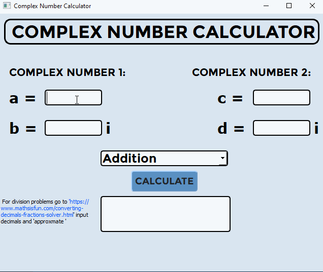

# Complex Number Calculator
 Add, subtract, multiply, and divide complex number expressions!
 
 I was doing some homework and became really interested in the complex number system, and how it ties some of the holes in algebra together. So I spent this last afternoon coding a calculator with a GUI to show my professor.
 
 **NOTE:** It's still a work in progress and crashes if you try to calculate with no values, or non-numbers inputted. I am also working on a function for the output of the division problems to be fractional, rather than decimal.
 
 **PROFESSOR:** If you would like to try it and have never used github, click on the green 'code' button in the top right and click 'download ZIP'. Open the ZIP folder, extract it, go into the 'src' folder and click on 'Complex Number Generator'
 
 
